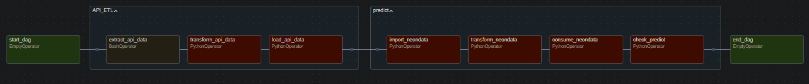
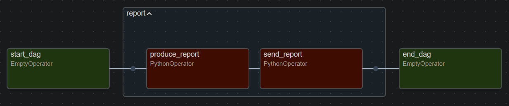
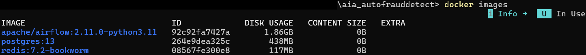

# :uk: *Table of contents*

Please note this documentation expects the reader to at least be aware of what Docker is.

1. 
  1.1 
  1.2 
  1.3 

2. 
  2.1 
  2.2 
  2.3 
  2.4 
  2.5 
  2.6 
  2.7 

---

# Understanding the system

### Line of thought

Surely the next question brought you here: **why** was this system built this way?

Take our source: an API we can call at most 5 times per minute simulating a transaction. We have no control whatsoever on this element, so we want to work on what it provides us with; amongst its wealth of information, one especially catches our attention - that is, the 'is_fraud' column supposed to serve as our target for prediction. Something we wouldn't know in a real-world case, so we can't reasonably use it - although it allows us to check which frauds our model properly detected or mistakenly labeled!

Now take on the other hand what allows us to make a prediction: the model. If we were to feed it something random it never learned about during training, it couldn't make any use of it; so does our training data match our API data? Answer: it doesn't.

This is where the thinking behind the system starts. As this is a student project, we do have some instructions and something to demonstrate; our pipelines here! So we use the training data we were fed, isolate its target, perform a little feature engineering for good measure and since the machine learning part isn't the priority, we train two simple models - a logistic regression and a random forest classifier to use the best of these two, the latter winning the competition.

Now, their performances are far from being great - but again, it's not the priority. Thus comes the interesting part: we did *not* alter our training data, so we will instead want to adapt what we receive from the API!

---

### The ETL process

From there follows the logic of the entire system: it's all about how to transform what our source provides us with, in order to feed information our model recognizes. Hence the demonstration from the schema: the **ETL** process first. We recover our API data through bash commands, but what we receive is not the exact json format we want to extract; it is nested as a string from the html format. So we begin transforming it **only** to make it usable as ordinary tabular, SQL data before loading it into our PostgreSQL on !

That's where we start anticipating the next half of our work involving the prediction. Why loading it *twice* on Neon? We use two different tables with different objectives: one is meant to have its data *appended* - those are our logs. Whichever the needs are, these logs serve as a backbone storing all the original data we recovered; although its format changed, the contents are the same as the **raw** data we were provided with! While it will only keep on accumulating rows, it becomes our reference. A better method for a real-world setting would've consisted in performing larger upload batches at a slower frequency instead of every time we pull data from the API, but without further instructions over this case, the idea was put aside.

Back to the topic, the second table is meant to serve operational means for our system: it only has its data *replaced*, referred to as the "work in progress". This is meant to improve operational speed; it will only serve as a source for the consumption of this data, meaning it doesn't need long-time storage which should be handled by another resource - only faster processing!

---

### Data consumption & prediction

The content of our "work in progress" is what we want to extract for prediction everytime a new batch is delivered. This is when we begin to **consume** said data with the second half of our system: once the newer batch is recovered, a new step of transformation begins. Remember what we said about our training & API data: we didn't want to touch the training set following instructions. That's why we transform instead what we acquired from the API!

Here, the objective is to make sure the contents will be understandable for our model, so it doesn't skip the unrecognized variables. Some of them appeared worth having when checking our model's features importance, such as the time of the day we produced through our feature engineering!

Once our data is transformed and ready for ingestion, we also recover the preprocessor used in the model to apply it on our data. This puts the finishing touches on making our *input* match what our model learned from.

Then finally comes the **predict** - whether the model will label the given transactions as fraudulent or not! Should it estimate it as legitimate, this is where this work ends; on the opposite though, it cannot be ignored! Still, we do not want to just leave it as-is; our instructions expect us *only* to send a notification, nothing more. Hence the last part: whenever the model assigns a fraudulent label, the system sends a message to the designated email address!

---

# How to run the system

### Requirements

* Boot up your Docker, since the project in containerized.
* Configure your `.env` file according to the example given in the root; links to the providers are included in said example.
* Find the folder where you've downloaded the project; open a terminal window inside the `aia_autofrauddetect` folder.
* *-Optional-* If you wish to run the notebook or produce a new model, create a fitting environment with the .yaml backup - else, skip this step.

---

### Starting Airflow

In the terminal window you opened under `\aia_autofrauddetect`, wake up our orchestrator with the following commands:
* `docker-compose up airflow-init` to create the necessary databases to run Airflow on (your terminal will be interactible on completion),
* `docker-compose up --build` to boot up this version of Airflow, *if* the databases are ready.

Both steps may take some time; the second will lock your terminal. Once the flurry of messages slows down, wait for a health message from the scheduler to come in to know when Airflow is ready, similar to this one:
`airflow-scheduler-1  | 127.0.0.1 - - [19/Mar/2026 19:06:32] "GET /health HTTP/1.1" 200 -`

---

### Accessing Airflow

It will be made available on your local host. Currently, the webserver (the interface you'll interact with) is set on the port 8085.

If you're familiar with how to edit Docker files and this port is unavailable, you can change it in the `docker-compose.yaml` file under the "airflow-webserver" service.

Otherwise, open your favorite browser and type the following address to access Airflow: `http://localhost:8085/`

---

### Running the system

It is divided into two components to meet our exams instructions; one being the entire `fraud_detection` itself making use of the machine learning model, the other to produce a `daily_report` of the transactions which ran through the system the day before.

Simply make use on the left hand side of the toggles to turn them on or off. Remember this will run Neon's services, which have a limit on their free tier!

Should one of the pulled transactions be considered as a fraud by the model, the script will send you an e-mail alert about it to the `smtp_receiver` address you entered in your `.env` file.

---

### Checking the results

Since producing a convenient dashboard wasn't the topic, you should either check NeonDB's user interface and find the `logs` SQL table, either do it the hard way by reading Airflow's live logs.

If you have the know-how, you could also alter the code a little to make the `daily_report` produce today's data on each trigger!

---

### Shutting down/deleting the project

There are two ways to shut down the project:
* If the terminal window is still open, while on it, hit ctrl+c to stop the running services.
* Otherwise, if any service is kept running in the background, open a new terminal window into this project's root `aia_autofrauddetect` folder, then enter `docker-compose down`.

Docker is hungry with disk space, so to delete the project and free up some storage, again make your way with a terminal window into the `aia_autofrauddetect` but this time type `docker images`. It should give you such a result:

The IDs will be unique to your instance and will differ from those displayed here. Identify their IDs, then type the following command: `docker rmi {ID}` where you will replace {ID} with those belonging to your instance - you will then have to pass this command three times (since three images are tied to the project).

This won't really remove *all* associated data, please refer to Docker's documentation for more advanced commands. A good data purge *will* definitely free up all space but I'd rather avoid breaking your entire setup if you have other containers running, mmh?

---

### Limitations

Again, please keep in mind this project was made relying simply on the free tier of Neon's services - keep an eye on it, for it becomes **your responsibility** should any costs be incurred!

The API simulating the transactions will tolerate at best 5 calls per minute, so it's meaningless to try to force it any further. For stability and reliability, the calls here were reduced to 3 calls every 120 seconds, since the latency throughout the various services may alter the counting made by the API limiter.

The `logs` table is only set to keep on ingesting new data: with the current code, no automated cleaning will be performed. If you leave this Airflow instance running on, it will only bloat up your Neon account storage and may again trigger expenses.

In short: once you're done testing, do delete the container/image/volumes associated in Docker as well as the two SQL tables (`detect_data` and `logs`) in Neon to free up some space and avoid any risks of a bill making its way to you!