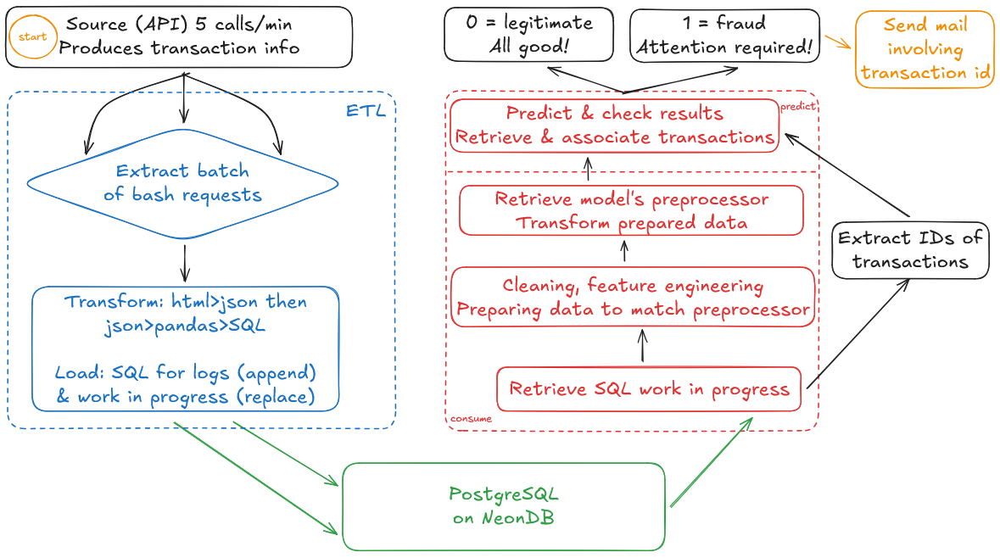

# :fr: *Sommaire*

Cette documentation part du principe que le lecteur sait ce qu'est Docker.

1. 
  1.1 
  1.2 
  1.3 

2. 
  2.1 
  2.2 
  2.3 
  2.4 
  2.5 
  2.6 
  2.7 

# Comprendre le système

Une question vous aura amené ici: **pourquoi** ce système a-t-il été ainsi conçu?

### Base de réflexion

Voyez notre source: une API que l'on peut appeler 5 fois maximum par minute, simulant une transaction. Nous ne disposons d'aucun contrôle sur cet élément, et devons donc travailler avec ce qu'elle nous fournit; parmi ses informations, la colonne 'is_fraud' est facilement remarquable puisqu'il s'agit de notre cible pour la prédiction. Or c'est un élément que nous n'aurions pas en situation réelle, que nous ne pouvons donc pas nous permettre d'utiliser en l'état bien qu'il s'agisse d'une information pratique pour contre-vérifier la réalité face à la prédiction fournie par notre modèle!

À l'opposé, nous avons l'élément au cœur de la prédiction: notre modèle. Si l'on lui fournissait une variable jamais vue avant, il ne saurait pas quoi en faire; une question essentielle surgit alors - les données fournies pour notre entraînement ont-elles le même format que les données fournies par l'API? La réponse est non.

C'est sur ce postulat que la réflexion autour du système débute; s'agissant d'un projet étudiant, nous disposons tout de même de quelques instructions sans oublier le sujet - les pipelines. Par conséquent nous ne toucherons pas aux données d'entraînement; nous ne ferons qu'en isoler la cible, faire un peu de feature engineering et puisque le machine learning n'est pas l'objet premier de ce thème, seuls deux modèles réduits au plus simple feront l'objet d'un entraînement - une régression logistique et une classification *random forest* (pour éviter tout barbarisme linguistique), où nous utiliserons cette dernière puisque plus performante.

À cet égard cependant, notons que leurs performances sont loin d'être impressionantes mais ne sont pas le sujet de ce projet. Intéressons-nous alors au travail d'adaptation autour des données fournies par l'API!

---

### La procédure d'ETL

De ce thème découle la logique du système: comment transformer la donnée l'alimentant, de sorte à ce qu'elle puisse être reconnue par notre modèle. Référons-nous au schéma en commençant par l'**ETL**: nous extrayons les données de l'API via des commandes bash, cependant les réponses ne sont pas immédiatement sous un format exploitable puisque nous obtenons une réponse html offrant une string contenant un json. S'en suivent un ensemble de transformations **exclusivement** pour permettre d'obtenir une donnée tabulaire, à charger ensuite sur notre PostgreSQL derrière !

Il nous faut anticiper les étapes en aval, en vue de la prédiction. Deux envois sont effectués vers Neon: la première table ne contient qu'un argument *append* où l'objectif est de produire un historique des transactions. Indépendemment des besoins en aval, ils deviennent une référence stockant la donnée **brute** qui nous a été fournie, bien qu'elle soit passée d'un format html au SQL! Cette table ne fera qu'accumuler des lignes dans le temps; une méthode plus réaliste aurait été de produire des *batches* plus larges pour un chargement moins fréquent plutôt que de réaliser l'opération à chaque itération, cependant faute d'instructions ce concept aura été ignoré.

Quant à la seconde table, celle-ci est prévue pour ne servir qu'aux besoins opérationnels en aval; celle-ci dispose d'un argument *replace*, où les nouvelles données fournies écrasent constamment les anciennes puisqu'il s'agit du "work in progress". L'objectif est de maintenir une vitesse d'exécution optimale au travers d'une ressource dédiée, non pas de stocker sur la durée!

---

### Consommation & prédiction

Le contenu de notre "work in progress" est donc ce que nous souhaitons extraire en vue d'une prédiction, dès lors qu'un nouveau *batch* est mis à disposition. C'est le début de l'étape de **consume**, ou consommation de notre donnée: dès acquisition, de nouvelles transformations cette fois sur le contenu sont opérées. Pour rappel, nos données d'entraînement diffèrent sensiblement de celles de l'API; c'est pourquoi nous transformons les données tirées de cette dernière!

L'objectif devient donc de rendre ces données d'API compréhensibles pour notre modèle, de sorte qu'il n'ignore pas les variables qu'il ne connaît pas. D'ailleurs, la plupart des variables produites lors du *feature engineering* se sont avérées avoir un poids important dans les *features* de notre modèle, telles que les périodes de la journée!

Une fois nos données donc transformées et prêtes pour ingestion, nous récupérons également l'objet de *preprocessing* utilisé dans notre modèle pour l'appliquer sur nos données; c'est le détail qui permet d'obtenir l'équivalent de toutes les informations qui ont pu être apprises lors de l'entraînement du modèle.

Venons-en pour finir au **predict**, la prédiction de fraude: si notre modèle estime la transaction comme légitime, son travail s'arrête là. Dans le cas opposé cependant, le résultat ne peut être ignoré; nos instructions n'attendent *que* la production d'une notification dans ce cas, rien de plus. Intervient alors le dernier élément du système où, à chaque label frauduleux produit, un email est envoyé à l'adresse fournie!

---

# Comment démarrer le système

### Pré-requis

* Démarrez votre Docker.
* Configurez votre fichier `.env` d'après l'exemple donné à la racine; les liens vers les fournisseurs y seront inclus.
* Trouvez le dossier où vous avez téléchargé le projet; ouvrez une fenêtre de terminal sous son dossier `aia_autofrauddetect`.
* *-Optionnel-* Si vous voulez faire tourner le notebook ou produire un nouveau modèle, créez un environnement avec le .yaml - autrement, sautez cette étape.

---

### Démarrer Airflow

Dans la fenêtre de terminal où `\aia_autofrauddetect` est ouvert, démarrez l'orchestrateur avec les commandes suivantes:
* `docker-compose up airflow-init` pour créer les bases de données nécessaires au fonctionnement d'Airflow (votre terminal sera de nouveau actif une fois la procédure complétée),
* `docker-compose up --build` pour démarrer cette version d'Airflow, *si* les bases de données sont prêtes.

Les deux étapes demanderont un peu de temps; la seconde verrouillera votre terminal. Une fois que le défilement de messages aura ralenti, attendez un message de type *health* provenant du *scheduler* pour déceler quand Airflow sera prêt, similaire à celui-ci:
`airflow-scheduler-1  | 127.0.0.1 - - [19/Mar/2026 19:06:32] "GET /health HTTP/1.1" 200 -`

---

### Ouvrir Airflow

Airflow sera disponible sous votre *local host*. En l'état, le *webserver* (l'interface utilisateur) sera liée au port 8085.

Si vous êtes familier avec l'édition de fichiers Docker et que ce port est indisponible, vous pouvez le modifier dans le `docker-compose.yaml` sous le service "airflow-webserver".

Autrement, ouvrez `http://localhost:8085/` avec votre navigateur internet favori!

---

### Lancer le système

Celui-ci est divisé en deux composants d'après nos instructions de certification; le premier étant le système lui-même de `fraud_detection` reposant sur du machine learning, le second produisant un rapport quotidien (`daily_report`) des transactions observées la veille.

Utilisez simplement les interrupteurs à gauche pour les dés/activer. Gardez à l'esprit qu'ils ont recours aux services de Neon, limités dans l'utilisation gratuite!

Si l'une des transactions est alors considérée frauduleuse par le modèle, le script vous enverra une alerte e-mail à l'adresse `smtp_receiver` que vous aurez paramétrée dans votre fichier `.env`.

---

### Vérifier les résultats

La production d'un tableau de bord n'était pas le sujet de la certification; si vous souhaitez vérifier les résultats, il vous faudra soit consulter l'interface de Neon et chercher sa table de `logs`, soit consulter les logs live d'Airflow.

Autrement, si vous êtes familier avec le code, vous pourriez l'altérer facilement en forçant le `daily_report` à produire les données du jour!

---

### Arrêter/supprimer le projet

Deux méthodes possibles pour arrêter le projet:
* Si votre fenêtre de terminal est toujours ouverte, revenez dessus puis appuyez sur ctrl+c pour arrêter le service.
* Autrement, si celui-ci tournait en fond, ouvrez une nouvelle fenêtre de terminal dans la racine `aia_autofrauddetect` de ce projet, puis tapez `docker-compose down`.

Docker est très consommateur en matière d'espace disque, donc pour en libérer en supprimant le projet, de nouveau ouvrez une fenêtre de terminal sous `aia_autofrauddetect` pour ensuite saisir `docker images`. Vous devriez obtenir le résultat suivant:

Les IDs seront uniques à votre instance et diffèreront de l'affichage ci-dessus. Repérez-les avant de saisir `docker rmi {ID}` où il vous faudra remplacer {ID} par celles propres à votre instance - à réaliser donc trois fois, puisque trois images sont associées au projet.

*Toutes* les données ne seront pas supprimées, donc référez-vous à la documentation Docker si vous souhaitez des commandes plus avancées pour véritablement tout supprimer - une purge Docker *fonctionnerait* sinon, mais supprimerait vos autres conteneurs!

---

### Limites

Une dernière fois, gardez à l'esprit que ce projet a été conçu avec le plan gratuit de Neon - il est de **votre responsabilité** de surveiller sa télémétrie pour éviter toute facturation!

L'API simulant les transactions n'accepte que 5 appels par minute au mieux, inutile d'en chercher davantage. Pour sa stabilité opérationnelle, les appels du projet ont été réduits à 3 requêtes toutes les 120 secondes car la latence des différents services peut jouer sur le compte du limiteur d'API, en reportant le compte d'un appel sur la minute suivante faute de latence, tandis que le prochain batch s'effectue à temps - et compte donc plus de 5 appels/minute.

La table des `logs` n'est conçue que de sorte à ingérer de nouvelles données: en l'état, il n'y a aucun nettoyage automatisé. Si vous laissez donc Airflow tourner en fond, elle n'aura de cesse de gonfler l'espace de stockage occupé par le projet jusqu'à saturer votre utilisation gratuite, entraînant potentiellement une facturation au-delà.

En bref: une fois la mise à l'essai finie, supprimez tout container/image/volume associé au projet ainsi que les tables SQL (`detect_data` and `logs`) dans Neon pour libérer de l'espace et éviter tout risque de facturation!