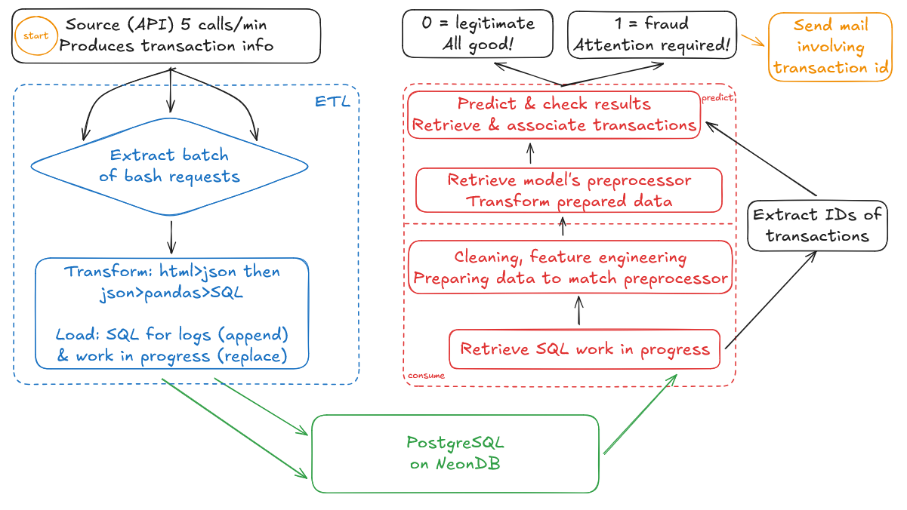

*[English translation](#uk-understanding-the-system) follows below with duplication of the schema for convenience.*

# :fr: Comprendre le système

Une question vous aura amené ici: **pourquoi** ce système a-t-il été ainsi conçu?

### Base de réflexion

Voyez notre source: une API que l'on peut appeler 5 fois maximum par minute, simulant une transaction. Nous ne disposons d'aucun contrôle sur cet élément, et devons donc travailler avec ce qu'elle nous fournit; parmi ses informations, la colonne 'is_fraud' est facilement remarquable puisqu'il s'agit de notre cible pour la prédiction. Or c'est un élément que nous n'aurions pas en situation réelle, que nous ne pouvons donc pas nous permettre d'utiliser en l'état bien qu'il s'agisse d'une information pratique pour contre-vérifier la réalité face à la prédiction fournie par notre modèle!

À l'opposé, nous avons l'élément au cœur de la prédiction: notre modèle. Si l'on lui fournissait une variable jamais vue avant, il ne saurait pas quoi en faire; une question essentielle surgit alors - les données fournies pour notre entraînement ont-elles le même format que les données fournies par l'API? La réponse est non.

C'est sur ce postulat que la réflexion autour du système débute; s'agissant d'un projet étudiant, nous disposons tout de même de quelques instructions sans oublier le sujet - les pipelines. Par conséquent nous ne toucherons pas aux données d'entraînement; nous ne ferons qu'en isoler la cible, faire un peu de feature engineering et puisque le machine learning n'est pas l'objet premier de ce thème, seuls deux modèles réduits au plus simple feront l'objet d'un entraînement - une régression logistique et une classification *random forest* (pour éviter tout barbarisme linguistique), où nous utiliserons cette dernière puisque plus performante.

À cet égard cependant, notons que leurs performances sont loin d'être impressionantes mais ne sont pas le sujet de ce projet. Intéressons-nous alors au travail d'adaptation autour des données fournies par l'API!

### La procédure d'ETL

De ce thème découle la logique du système: comment transformer la donnée l'alimentant, de sorte à ce qu'elle puisse être reconnue par notre modèle. Référons-nous au schéma en commençant par l'**ETL**: nous extrayons les données de l'API via des commandes bash, cependant les réponses ne sont pas immédiatement sous un format exploitable puisque nous obtenons une réponse html offrant une string contenant un json. S'en suivent un ensemble de transformations **exclusivement** pour permettre d'obtenir une donnée tabulaire, à charger ensuite sur notre PostgreSQL derrière !

Il nous faut anticiper les étapes en aval, en vue de la prédiction. Deux envois sont effectués vers Neon: la première table ne contient qu'un argument *append* où l'objectif est de produire un historique des transactions. Indépendemment des besoins en aval, ils deviennent une référence stockant la donnée **brute** qui nous a été fournie, bien qu'elle soit passée d'un format html au SQL! Cette table ne fera qu'accumuler des lignes dans le temps; une méthode plus réaliste aurait été de produire des *batches* plus larges pour un chargement moins fréquent plutôt que de réaliser l'opération à chaque itération, cependant faute d'instructions ce concept aura été ignoré.

Quant à la seconde table, celle-ci est prévue pour ne servir qu'aux besoins opérationnels en aval; celle-ci dispose d'un argument *replace*, où les nouvelles données fournies écrasent constamment les anciennes puisqu'il s'agit du "work in progress". L'objectif est de maintenir une vitesse d'exécution optimale au travers d'une ressource dédiée, non pas de stocker sur la durée!

### Consommation & prédiction

Le contenu de notre "work in progress" est donc ce que nous souhaitons extraire en vue d'une prédiction, dès lors qu'un nouveau *batch* est mis à disposition. C'est le début de l'étape de **consume**, ou consommation de notre donnée: dès acquisition, de nouvelles transformations cette fois sur le contenu sont opérées. Pour rappel, nos données d'entraînement diffèrent sensiblement de celles de l'API; c'est pourquoi nous transformons les données tirées de cette dernière!

L'objectif devient donc de rendre ces données d'API compréhensibles pour notre modèle, de sorte qu'il n'ignore pas les variables qu'il ne connaît pas. D'ailleurs, la plupart des variables produites lors du *feature engineering* se sont avérées avoir un poids important dans les *features* de notre modèle, telles que les périodes de la journée!

Une fois nos données donc transformées et prêtes pour ingestion, nous récupérons également l'objet de *preprocessing* utilisé dans notre modèle pour l'appliquer sur nos données; c'est le détail qui permet d'obtenir l'équivalent de toutes les informations qui ont pu être apprises lors de l'entraînement du modèle.

Venons-en pour finir au **predict**, la prédiction de fraude: si notre modèle estime la transaction comme légitime, son travail s'arrête là. Dans le cas opposé cependant, le résultat ne peut être ignoré; nos instructions n'attendent *que* la production d'une notification dans ce cas, rien de plus. Intervient alors le dernier élément du système où, à chaque label frauduleux produit, un email est envoyé à l'adresse fournie!

---

# :uk: Understanding the system

### Line of thought

Surely the next question brought you here: **why** was this system built this way?

Take our source: an API we can call at most 5 times per minute simulating a transaction. We have no control whatsoever on this element, so we want to work on what it provides us with; amongst its wealth of information, one especially catches our attention - that is, the 'is_fraud' column supposed to serve as our target for prediction. Something we wouldn't know in a real-world case, so we can't reasonably use it - although it allows us to check which frauds our model properly detected or mistakenly labeled!

Now take on the other hand what allows us to make a prediction: the model. If we were to feed it something random it never learned about during training, it couldn't make any use of it; so does our training data match our API data? Answer: it doesn't.

This is where the thinking behind the system starts. As this is a student project, we do have some instructions and something to demonstrate; our pipelines here! So we use the training data we were fed, isolate its target, perform a little feature engineering for good measure and since the machine learning part isn't the priority, we train two simple models - a logistic regression and a random forest classifier to use the best of these two, the latter winning the competition.

Now, their performances are far from being great - but again, it's not the priority. Thus comes the interesting part: we did *not* alter our training data, so we will instead want to adapt what we receive from the API!

### The ETL process

From there follows the logic of the entire system: it's all about how to transform what our source provides us with, in order to feed information our model recognizes. Hence the demonstration from the schema: the **ETL** process first. We recover our API data through bash commands, but what we receive is not the exact json format we want to extract; it is nested as a string from the html format. So we begin transforming it **only** to make it usable as ordinary tabular, SQL data before loading it into our PostgreSQL on !

That's where we start anticipating the next half of our work involving the prediction. Why loading it *twice* on Neon? We use two different tables with different objectives: one is meant to have its data *appended* - those are our logs. Whichever the needs are, these logs serve as a backbone storing all the original data we recovered; although its format changed, the contents are the same as the **raw** data we were provided with! While it will only keep on accumulating rows, it becomes our reference. A better method for a real-world setting would've consisted in performing larger upload batches at a slower frequency instead of every time we pull data from the API, but without further instructions over this case, the idea was put aside.

Back to the topic, the second table is meant to serve operational means for our system: it only has its data *replaced*, referred to as the "work in progress". This is meant to improve operational speed; it will only serve as a source for the consumption of this data, meaning it doesn't need long-time storage which should be handled by another resource - only faster processing!

### Data consumption & prediction

The content of our "work in progress" is what we want to extract for prediction everytime a new batch is delivered. This is when we begin to **consume** said data with the second half of our system: once the newer batch is recovered, a new step of transformation begins. Remember what we said about our training & API data: we didn't want to touch the training set following instructions. That's why we transform instead what we acquired from the API!

Here, the objective is to make sure the contents will be understandable for our model, so it doesn't skip the unrecognized variables. Some of them appeared worth having when checking our model's features importance, such as the time of the day we produced through our feature engineering!

Once our data is transformed and ready for ingestion, we also recover the preprocessor used in the model to apply it on our data. This puts the finishing touches on making our *input* match what our model learned from.

Then finally comes the **predict** - whether the model will label the given transactions as fraudulent or not! Should it estimate it as legitimate, this is where this work ends; on the opposite though, it cannot be ignored! Still, we do not want to just leave it as-is; our instructions expect us *only* to send a notification, nothing more. Hence the last part: whenever the model assigns a fraudulent label, the system sends a message to the designated email address!